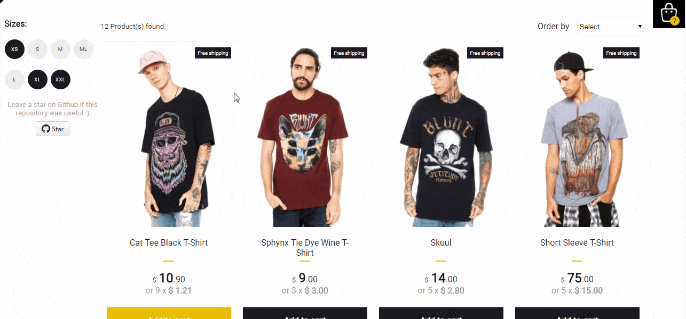

## 🛍️ Simple ecommerce cart application 

<p align="center">

  
</p>

This simple shopping cart prototype shows how React components and Redux can be used to build a
friendly user experience with instant visual updates and scaleable code in ecommerce applications.

#### Features

- Add and remove products from the floating cart
- Sort products by highest to lowest and lowest to highest price
- Filter products by available sizes
- Products persist in floating cart after page reloads
- Unit tests, integration tests and e2e testing
- Responsive design


## Build/Run

#### Requirements

- Node.js
- NPM

```javascript

/* First, Install the needed packages */
npm install

/* Then start both Node and React */
npm start

/* To run the tests */
npm run test

/* Running e2e tests */
npm run wdio


```

## About tests

- Unit tests
  - All components have at least a basic smoke test
- Integration tests
  - Fetch product and add to cart properly
- e2e
  - Webdriverio - Add and remove product from cart


